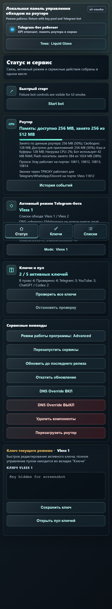

<a href="https://t.me/bypass_keenetic"></a>

# bypass_keenetic

Локальная панель управления обходом блокировок на роутерах Keenetic.

> Проверено на Keenetic Giga с актуальной KeeneticOS.

## Что изменилось

Раньше у программы было несколько веток с разным поведением: простая версия, independent-версия с пулом ключей и web-only версия. Теперь они объединены в одну ветку `main`.

Выбор варианта работы больше не требует установки другой ветки. В веб-интерфейсе есть **режим работы программы**:
- **Простой** — интерфейс и Telegram-бот;
- **Сложный** — интерфейс с пулом ключей и Telegram-бот;
- **Web only** — интерфейс с пулом ключей без Telegram-бота.

Переход между режимами выполняется с подтверждением. Ключи, пул ключей, пользовательские проверки, списки обхода и настройки Telegram сохраняются.

## Возможности

- Веб-интерфейс на `http://192.168.1.1:8080/` для ПК и телефона.
- Разделы **Статус**, **Ключи**, **Списки**.
- Telegram-бот для режимов **Простой** и **Сложный**.
- Поддержка двух протоколов `Vless`, `Vmess`, `Trojan`, `Shadowsocks`.
- Пул ключей для каждого протокола: ручное добавление, удаление, применение, импорт subscription.
- Проверка ключей через Telegram API, YouTube и дополнительные сервисы.
- Готовые проверки: ChatGPT/OpenAI/Codex, Claude, Gemini, Copilot, Perplexity, Grok, DeepSeek, Discord, Meta AI/Instagram/Facebook.
- Добавление доменов выбранных проверок в список обхода текущего протокола.
- Диагностика роутера в блоке **Статус**: память, нагрузка, состояние DNS, время последнего обновления `ipset` и количество записей в наборах обхода.
- Автоматический обход realtime-звонков Telegram, WhatsApp и Discord: программа определяет активных клиентов, временно запоминает UDP-адреса звонка и отправляет их через TPROXY-порт выбранного протокола.
- Подтверждение опасных действий: смена режима, обновление, удаление компонентов, DNS Override, перезагрузка роутера, очистка пула.

## Установка

Сначала установите Entware на накопитель роутера:
- [инструкция Entware для Keenetic](https://github.com/znetworkx/bypass_keenetic/wiki/Install-Entware-and-Preparation)
- `aarch64`: [aarch64-installer.tar.gz](https://bin.entware.net/aarch64-k3.10/installer/aarch64-installer.tar.gz)
- `mipsel`: [mipsel-installer.tar.gz](https://bin.entware.net/mipselsf-k3.4/installer/mipsel-installer.tar.gz)

Важно: бот и bootstrap не заменяют подготовку накопителя и установку Entware. На Keenetic Entware живёт в `/opt` и обычно требует внешнее хранилище.

После Entware подключитесь к роутеру по SSH и выполните:

```sh
sh -c 'export PATH=/opt/bin:/opt/sbin:$PATH; OPKG="$(command -v opkg || echo /opt/bin/opkg)"; CURL_BIN="$(command -v curl || echo /opt/bin/curl)"; if [ ! -x "$CURL_BIN" ]; then "$OPKG" update && "$OPKG" install curl ca-bundle || exit 1; CURL_BIN="$(command -v curl || echo /opt/bin/curl)"; fi; "$CURL_BIN" -fsSL https://raw.githubusercontent.com/andruwko73/bypass_keenetic/main/bootstrap/install.sh | sh'
```

Команда выше является актуальной командой чистой установки из GitHub `main`. Она ставит минимальный `curl`, скачивает `bootstrap/install.sh`, затем bootstrap скачивает основной `script.sh`, веб-установщик, Telegram-бота и все runtime-модули.

Прогрев YouTube ставится сразу при чистой установке: в `/opt/etc/bot` попадают `youtube_edge_prefetch.py` и `youtube_edge_prefetch_runner.py`, а в `bot_config.py` добавляются параметры `youtube_edge_prefetch_*` и `youtube_edge_watch_warm_*`. После первичной установки `script.sh -install` запускает короткий внешний prefetch с меткой `Post-install`; после сохранения первичной формы и запуска основного бота запускается такой же короткий `first-run`; после обновления из веб-интерфейса запускается `Post-update`. Эта работа выполняется отдельным коротким процессом и не увеличивает постоянный RSS Telegram-бота.

При первой чистой установке откроется первичная настройка на `http://192.168.1.1:8080/`.

Нужно указать:
- BotFather token;
- Telegram username;
- при желании пароль для веб-интерфейса.

Если Telegram-бот не нужен, нажмите **Запустить режим Web only**. Пароль веб-интерфейса не обязателен: если его не задать, доступ останется только с локальных/private адресов.

Bootstrap перед заменой файлов создает backup и rollback-скрипт в `/opt/root/bypass-last-rollback.sh`.

## Обновление со старых веток

Переход на новую ветку `main` должен быть плавным с любой старой установленной версии:
- `main`;
- `codex/main`;
- `codex/main-v1`;
- `codex/independent-v1`;
- `codex/web-only-v1`;
- `feature/independent-rework`;
- `feature/web-only`;
- `feature/without-telegram-bot`.

В старом Telegram-боте или веб-интерфейсе можно нажать обновление/переустановку из текущей ветки. Старое имя ветки будет вести на новый код `main`, после чего установленная программа уже будет обновляться из `main`.

При обновлении сохраняются:
- `/opt/etc/bot_config.py` или `/opt/etc/bot/bot_config.py`;
- активные ключи;
- пул ключей;
- пользовательские проверки;
- списки обхода;
- выбранный режим работы программы.

Устаревшие артефакты старых вариантов очищаются: отдельный `web_bot.py`, старый web-only init-скрипт, tor/vpn пути и лишние runtime-файлы. Остаются только поддерживаемые протоколы: два `Vless`, `Vmess`, `Trojan`, `Shadowsocks`.

## Веб-интерфейс

**Статус**

Показывает состояние роутера, ключей, быстрый старт и сервисные команды. В режимах с ботом дополнительно отображаются Telegram API и активный режим Telegram-бота; в **Web only** эти элементы скрыты.

В блоке роутера DNS-часть отображается как диагностическая строка. Если DNS обслуживает штатный Keenetic `ndnproxy`, то `S56dnsmasq` не считается сломанным сервисом: он помечается как неиспользуемый, потому что порт `53` уже занят `ndnproxy`. В этом режиме домены из списков обхода заранее резолвятся в `ipset` скриптом `/opt/bin/unblock_ipset.sh`, а актуальность наборов поддерживается каждые 15 минут. Установщик и обновление регистрируют задачу в активном root-crontab Entware через `S99unblock refresh`, а сам `S99unblock` дополнительно запускает fallback-scheduler, чтобы refresh не зависел от конкретного поведения cron на прошивке. При включенном `dnsmasq` полный refresh по умолчанию выполняется не чаще раза в час и пропускается, если статус обновлялся недавно; между полными refresh scheduler каждые 30 секунд выполняет легкую runtime-dedupe для пересечений `Vless 1` / `Vless 2`, удаляя общие IP из набора, который не является текущим маршрутом YouTube.

Кнопки **DNS Override ВКЛ** и **DNS Override ВЫКЛ** управляют переходом между штатным DNS Keenetic и основным DNS через `dnsmasq`. При включенном DNS Override `dnsmasq` становится основным обработчиком DNS на роутере и наполняет `ipset` динамически по route-файлам. При выключенном DNS Override используется fallback через `ndnproxy` и предварительное обновление `ipset`. Обновление программы и перезагрузка сервисов не переключают DNS Override скрыто: режим меняется только через явную кнопку в веб-интерфейсе или Telegram-боте. Плановый refresh `/opt/bin/unblock_ipset.sh` остается нужен и при `dnsmasq`: он актуализирует статические адреса, IPv6 fallback-наборы, UDP/QUIC-наборы и убирает пересечения между route-файлами.

UDP/443 обрабатывается по содержимому списков: основные наборы протоколов отвечают за TCP и обычную UDP-маршрутизацию через прозрачный прокси, а `unblock*udp` наполняются только YouTube/QUIC-доменами из соответствующего списка. Если YouTube перенесен в `Vless 1`, `Vless 2`, `Vmess`, `Trojan` или `Shadowsocks`, QUIC-блокировка для этого протокола автоматически отключается, чтобы видео могло идти через тот же ключ. Если YouTube и Telegram находятся в одном списке, маршрут Telegram остается в этом же протоколе. TCP-порты Telegram/мобильных push-сервисов (`5222`, `5223`, `5228`, `5229`, `5230`) автоматически направляются в тот Vless-маршрут, где находится Telegram. UDP-настройки нельзя считать устаревшими после перехода на `dnsmasq`: они нужны для YouTube/QUIC-политики, realtime-звонков и временных TPROXY-наборов. При необходимости базовую политику можно поменять в `bot_config.py` флагами `udp_quic_block_*_enabled`, `youtube_quic_policy` и `telegram_udp_policy`.

Realtime-звонки обрабатываются без отдельной кнопки в интерфейсе. Когда устройство в локальной сети общается с Telegram, WhatsApp или Discord, netfilter временно помечает его как активного клиента звонков, а фоновый conntrack-learning ищет связанные UDP-медиа-потоки. Найденные адреса добавляются во временные наборы `bypass_tg_call_*` и отправляются через UDP TPROXY-порт того протокола, где сейчас находится соответствующий сервис. По умолчанию используются порты `11812` для `Vless`, `11814` для `Vless 2`, `11815` для `Vmess`, `11829` для `Trojan` и `11802` для `Shadowsocks`. Клиентская активность хранится около 15 минут, адреса звонка — около 4 часов; таймауты можно поменять параметрами `telegram_call_learning_client_timeout_seconds` и `telegram_call_learning_address_timeout_seconds` в `bot_config.py`.

**Ключи**

Позволяет редактировать активный ключ, переключать протоколы, работать с пулом ключей и запускать проверки. В простом режиме пул ключей и расширенные проверки скрыты.

**Списки**

Редактирование списков обхода для каждого протокола. Готовые наборы можно добавлять кнопками: Telegram, YouTube, ChatGPT/Codex, Claude, Gemini, Copilot, Perplexity, Grok, DeepSeek, Discord, Chrome Remote Desktop, Meta AI/Instagram/Facebook или все сервисы сразу.

## Telegram-бот

Telegram-бот использует нижнюю клавиатуру и работает в режимах **Простой** и **Сложный**.

Основные разделы:
- управление активным протоколом и ключами;
- списки обхода;
- пул ключей в сложном режиме;
- сервисные команды;
- обновление до последнего релиза с подтверждением.

Путь к пулу: **Ключи** -> **Пул ключей**. Кнопки ключей содержат короткий код протокола, поэтому старая кнопка из другого пула не применит ключ к неверному протоколу.

## Пул ключей

Пул хранится локально на роутере:
- `/opt/etc/bot/key_pools.json`;
- `/opt/etc/bot/key_probe_cache.json`;
- `/opt/etc/bot/custom_checks.json`.

Проверка пула не переключает основной активный ключ и не разрывает текущее подключение. Для проверки остальных ключей запускается временный `xray` с отдельными SOCKS-портами. Результаты сохраняются сразу после проверки каждого ключа. Полная проверка проходит все ключи из всех пулов; при высокой нагрузке CPU или нехватке памяти она замедляется либо ставится на паузу, чтобы не забивать роутер.

Активный ключ автоматически добавляется в свой пул, если его там нет. Это защищает от ситуации, когда текущий рабочий ключ пропадает из интерфейса после импорта или ручной чистки пула. Если один и тот же набор Vless-ключей используется и для `Vless 1`, и для `Vless 2`, их можно хранить одинаковыми списками; программа не печатает ключи в диагностике, не возвращает их в JSON-ответах действий и сравнивает их по внутренним идентификаторам.

При нехватке памяти проверка останавливается и может быть продолжена позже.

## Безопасность данных

Реальные ключи, токены Telegram, пароли, локальные пулы и кеши проверок должны оставаться только на роутере. Проверки Telegram и YouTube считают HTTP 4xx ответом отказа сервиса, а не подтверждением доступа.

В репозиторий не добавляются:
- `bot_config.py`;
- `.env`;
- дампы роутера;
- временные `xray`-конфиги;
- файлы с живыми прокси-ключами.

## Скриншоты

Скриншоты веб-интерфейса сняты в режиме **Сложный**. Поля и строки с ключами замаскированы.

Страница первичной настройки:

<a href="docs/screenshots/installer-setup.png">
  
</a>

Статус и сервис, версия для ПК:

<a href="docs/screenshots/web-ui-status.png">
  
</a>

Статус и сервис, версия для телефона:

<a href="docs/screenshots/web-ui-status-mobile.png">
  
</a>

Активный ключ:

<a href="docs/screenshots/web-ui-key.png">
  
</a>

Пул ключей:

<a href="docs/screenshots/web-ui-pool.png">
  
</a>

Subscription:

<a href="docs/screenshots/web-ui-subscription.png">
  
</a>

Проверки доступности:

<a href="docs/screenshots/web-ui-check.png">
  
</a>

Списки обхода:

<a href="docs/screenshots/web-ui-lists.png">
  
</a>
