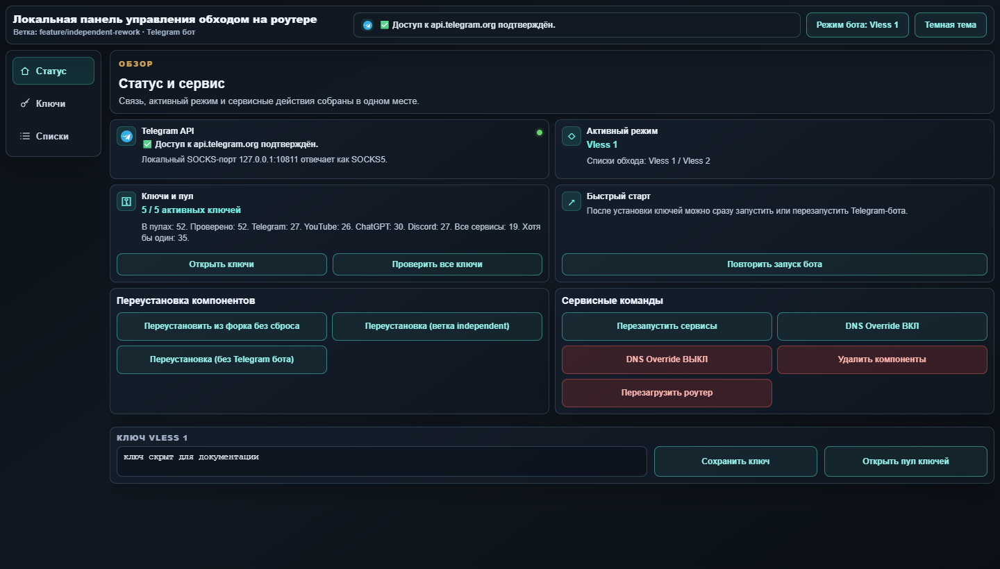
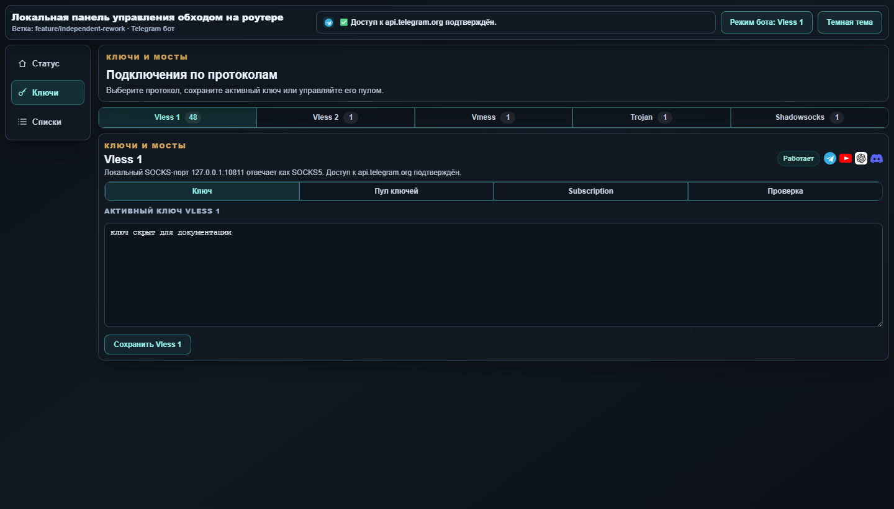
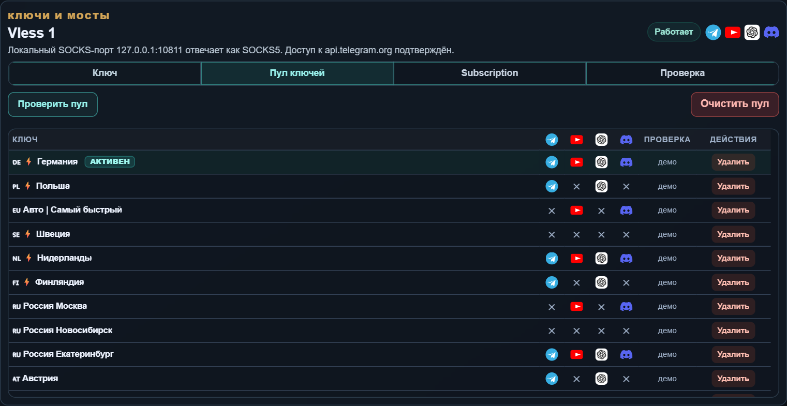
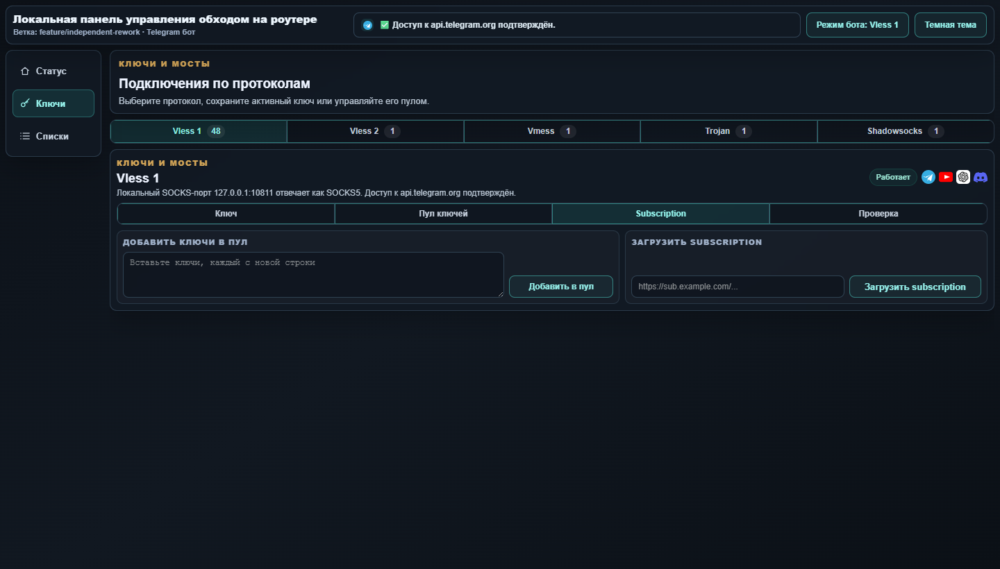
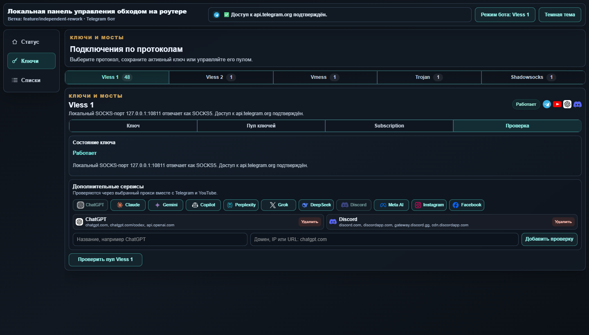

<a href="https://t.me/bypass_keenetic"></a>

## О ветке

`feature/independent-rework` — версия `bypass_keenetic` с Telegram-ботом, локальным веб-интерфейсом и расширенным управлением пулом ключей для Keenetic.

Основана на форке [andruwko73/bypass_keenetic](https://github.com/andruwko73/bypass_keenetic) проекта `keenetic-dev/bypass_keenetic_dev`.

Главное в этой ветке:
- веб-интерфейс на `http://192.168.1.1:8080/` с тремя разделами: **Статус**, **Ключи**, **Списки**;
- Telegram-бот с управлением ключами, списками, установкой, сервисом и пулом ключей;
- Vless 1, Vless 2, Vmess, Trojan и Shadowsocks;
- пул ключей для каждого протокола с применением, удалением, ручным добавлением и загрузкой subscription;
- проверка Telegram API, YouTube и дополнительных сервисов через выбранный ключ;
- готовые пресеты проверок: ChatGPT/OpenAI/Codex, Claude, Gemini, Copilot, Perplexity, Grok, DeepSeek, Discord, Meta AI, Instagram, Facebook;
- переустановка между `main`, `feature/independent-rework` и `feature/web-only` с сохранением локальных настроек, ключей, пулов и списков обхода.

## Установка

Сначала установите Entware на накопитель роутера:
- [инструкция Entware для Keenetic](https://github.com/znetworkx/bypass_keenetic/wiki/Install-Entware-and-Preparation)
- `aarch64`: [aarch64-installer.tar.gz](https://bin.entware.net/aarch64-k3.10/installer/aarch64-installer.tar.gz)
- `mipsel`: [mipsel-installer.tar.gz](https://bin.entware.net/mipselsf-k3.4/installer/mipsel-installer.tar.gz)

После Entware подключитесь к роутеру по SSH и выполните:

```sh
sh -c 'export PATH=/opt/bin:/opt/sbin:$PATH; OPKG="$(command -v opkg || echo /opt/bin/opkg)"; CURL_BIN="$(command -v curl || echo /opt/bin/curl)"; if [ ! -x "$CURL_BIN" ]; then "$OPKG" update && "$OPKG" install curl ca-bundle || exit 1; CURL_BIN="$(command -v curl || echo /opt/bin/curl)"; fi; "$CURL_BIN" -fsSL https://raw.githubusercontent.com/andruwko73/bypass_keenetic/feature/independent-rework/bootstrap/install.sh | sh'
```

При первой чистой установке откроется страница первичной настройки на `http://192.168.1.1:8080/`: BotFather token, Telegram username, app api id и app api hash. Если Telegram-бот не нужен, нажмите **Установить без бота Telegram** — установка переключится на `feature/web-only`.

Bootstrap перед заменой файлов создает backup и rollback-скрипт в `/opt/root/bypass-last-rollback.sh`.

## Веб-интерфейс

Веб-интерфейс рассчитан на ПК и телефон:
- **Статус** — связь с Telegram API, текущий режим, быстрый старт, переустановка компонентов и сервисные команды;
- **Ключи** — вкладки протоколов, активный ключ, пул ключей, subscription и проверки;
- **Списки** — редактирование списков обхода по каждому протоколу.

Большинство действий выполняется без полной перезагрузки страницы. Опасные действия в веб-интерфейсе требуют подтверждения: удаление компонентов, перезагрузка роутера, DNS Override, очистка пула и удаление пользовательских проверок.

## Пул ключей

Пул хранится локально на роутере в `/opt/etc/bot/key_pools.json`, кеш проверок — в `/opt/etc/bot/key_probe_cache.json`.

Проверка пула не переключает основной активный ключ и не разрывает текущее подключение. Активный ключ текущего режима пропускается в фоновой проверке пула, его состояние берется из живого подключения. Для остальных ключей запускается временный `xray` с отдельными SOCKS-портами; результаты записываются сразу после проверки каждого ключа, после чего память освобождается. При нехватке свободной памяти проверка останавливается и продолжится при следующем запуске.

Статусы в таблице:
- значок Telegram — доступность `api.telegram.org`;
- значок YouTube — доступность YouTube;
- иконки дополнительных сервисов — проверки, выбранные пользователем в разделе **Проверка**.

## Telegram-бот

Telegram-бот использует нижнюю клавиатуру без дублирования меню кнопками в тексте сообщений.

Путь к пулу: **Ключи и мосты** → **Пул ключей**. Внутри можно выбрать протокол, применить ключ из списка, удалить конкретный ключ, добавить ключи вручную, загрузить subscription, проверить пул и вернуться назад. Кнопки ключей содержат короткий код протокола, поэтому старая кнопка из другого пула не применит ключ к неверному протоколу.

Опасные сервисные действия и переустановка из Telegram также требуют подтверждения: переходы между `main`, `feature/independent-rework`, `feature/web-only`, удаление компонентов, DNS Override и перезагрузка роутера.

## Переустановка

Кнопки переустановки доступны в веб-интерфейсе и Telegram-боте:
- **Переустановить из форка без сброса** — обновление из `main`;
- **Переустановка (ветка independent)** — обновление из `feature/independent-rework`;
- **Переустановка (без Telegram бота)** — переход в `feature/web-only`.

При переходах сохраняются:
- `bot_config.py` с настройками Telegram и веб-интерфейса;
- активные ключи;
- пул ключей;
- пользовательские проверки;
- списки обхода.

## Безопасность данных

Реальные ключи, токены Telegram, `api_id`, `api_hash`, пароли, локальные пулы и кеши проверок должны оставаться только на роутере. В репозиторий не добавляются `bot_config.py`, `.env`, локальные дампы роутера, временные `xray`-конфиги и файлы с живыми прокси-ключами.

Скриншоты ниже сделаны с демонстрационными данными: активный ключ скрыт, идентификаторы ключей в пуле не показываются, списки обхода заменены безопасными примерами.

## Скриншоты

Страница первичной настройки:

<a href="docs/screenshots/installer-setup.png">
  
</a>

Статус и сервис:

<a href="docs/screenshots/web-ui-status.png">
  
</a>

Активный ключ:

<a href="docs/screenshots/web-ui-key.png">
  
</a>

Пул ключей:

<a href="docs/screenshots/web-ui-pool.png">
  
</a>

Subscription:

<a href="docs/screenshots/web-ui-subscription.png">
  
</a>

Проверки доступности:

<a href="docs/screenshots/web-ui-check.png">
  
</a>

Списки обхода:

<a href="docs/screenshots/web-ui-lists.png">
  
</a>
