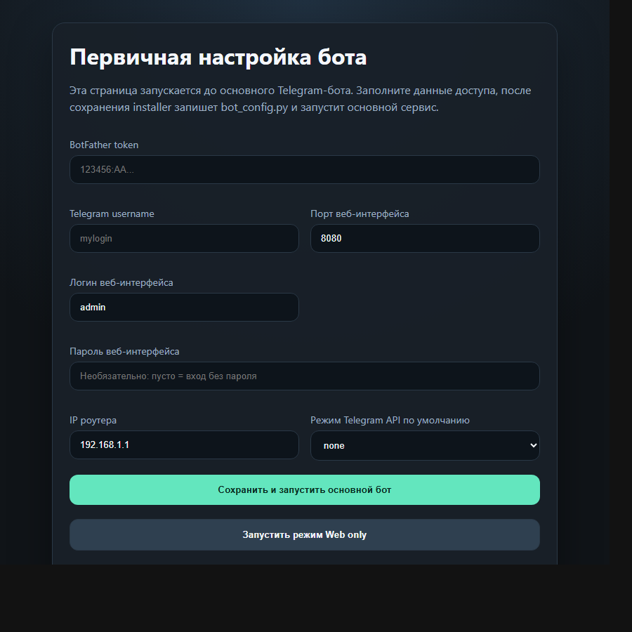
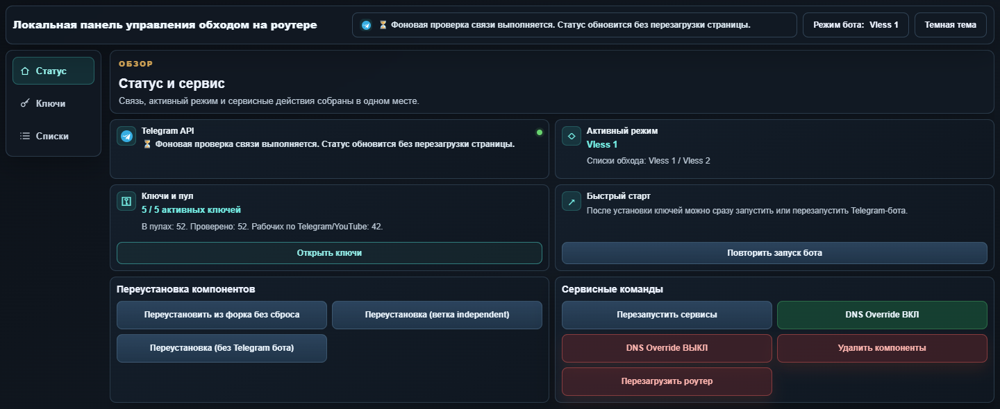
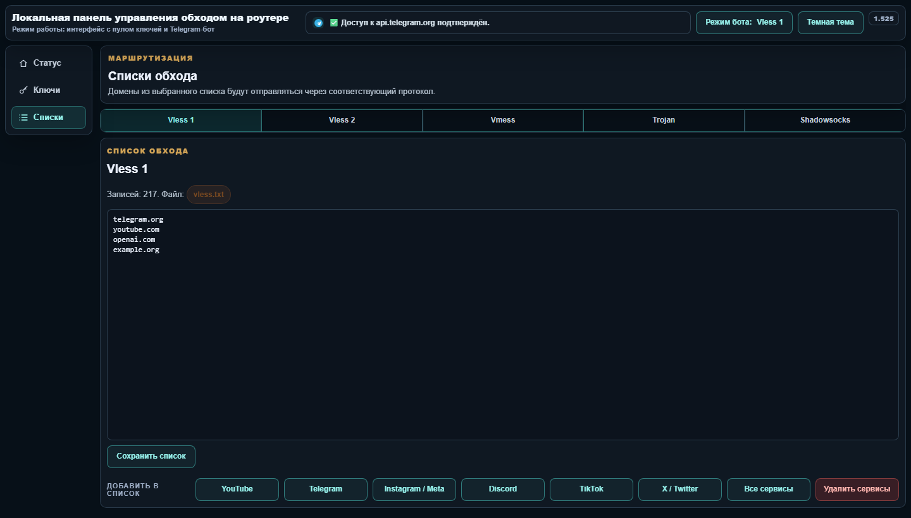

<a href="https://t.me/bypass_keenetic"></a>

## Об этом форке
Это форк проекта `keenetic-dev/bypass_keenetic_dev`.
- поддержка на [форуме](https://forum.keenetic.com/topic/14672-%D0%BE%D0%B1%D1%85%D0%BE%D0%B4%D0%B0-%D0%B1%D0%BB%D0%BE%D0%BA%D0%B8%D1%80%D0%BE%D0%B2%D0%BE%D0%BA-%D0%BC%D0%BD%D0%BE%D0%B3%D0%BE-%D0%BD%D0%B5-%D0%B1%D1%8B%D0%B2%D0%B0%D0%B5%D1%82) и [чате телеграм](https://t.me/bypass_keenetic)
- [Полное описание читайте в оригинальной вики](https://github.com/znetworkx/bypass_keenetic/wiki)

В текущем форке добавлены:
- веб-интерфейс установки ключей и мостов
- выбор маршрутизации Telegram через локальный VPN/прокси
- поддержка VLESS вместе с Shadowsocks, Trojan и Vmess
- поддержка двух отдельных маршрутов VLESS с разными ключами и списками сайтов
- пул ключей, сервисные списки и обновление из ветки independent прямо из веб-интерфейса
- дальнейшее обновление одним кликом

### Новые функции (ветка feature/independent-rework)
- **Пул ключей** — возможность хранить несколько ключей для каждого протокола (Vless 1, Vless 2, Vmess, Trojan, Shadowsocks), применять нужный ключ кликом из пула и очищать весь пул выбранного протокола одной кнопкой.
- **Автоматическая проверка ключей** — фоновое тестирование ключей из пула: отображаются значки Telegram и YouTube, а статус протоколов обновляется без блокировки страницы настроек.
- **Subscription-ссылки** — поддержка загрузки ключей из subscription-URL (подписки) прямо через веб-интерфейс.
- **Сервисы по запросу** — команда Telegram-бота `/getlist [название] [маршрут]` и кнопка в меню списков добавляют актуальные домены YouTube, Telegram, Instagram/Meta, Discord, TikTok и X/Twitter из открытых списков `itdoginfo/allow-domains`.
- **Быстрое обновление ipset** — списки обхода загружаются пакетно через `ipset restore`, а домены резолвятся параллельно, поэтому большие списки применяются заметно быстрее.
- **API `/api/status`** — JSON-эндпоинт для получения статуса всех протоколов и пулов ключей. Используется веб-интерфейсом и подходит для внешнего мониторинга.
- **Статические иконки** — Telegram и YouTube иконки отображаются в веб-интерфейсе и сообщениях бота для наглядной индикации работоспособности каждого ключа.
- **Переустановка из ветки independent** — отдельная кнопка в Telegram-боте и на странице `192.168.1.1:8080` обновляет установку из ветки `feature/independent-rework` без сброса сохранённых ключей и списков.
- **Автоматический failover** — при обнаружении нерабочего активного ключа бот может автоматически переключиться на следующий ключ из пула.

## Установка (~30-60 минут с нуля)
- [Установка Entware](https://github.com/znetworkx/bypass_keenetic/wiki/Install-Entware-and-Preparation)
- Актуальный архив Entware для Keenetic на `aarch64`: [aarch64-installer.tar.gz](https://bin.entware.net/aarch64-k3.10/installer/aarch64-installer.tar.gz)
- Актуальный архив Entware для Keenetic на `mipsel`: [mipsel-installer.tar.gz](https://bin.entware.net/mipselsf-k3.4/installer/mipsel-installer.tar.gz)

## Быстрый bootstrap после Entware
Если Entware уже установлен и `/opt` готов, достаточно один раз зайти на роутер по SSH любым клиентом, например PuTTY, и запустить bootstrap-команду. Дальше интерактивная первичная настройка продолжится уже через браузер на странице роутера, без ручной загрузки файлов через PuTTY.

Интерактивный запуск:

```sh
sh -c 'export PATH=/opt/bin:/opt/sbin:$PATH; OPKG="$(command -v opkg || echo /opt/bin/opkg)"; CURL_BIN="$(command -v curl || echo /opt/bin/curl)"; if [ ! -x "$CURL_BIN" ]; then "$OPKG" update && "$OPKG" install curl ca-bundle || exit 1; CURL_BIN="$(command -v curl || echo /opt/bin/curl)"; fi; "$CURL_BIN" -fsSL https://raw.githubusercontent.com/andruwko73/bypass_keenetic/feature/independent-rework/bootstrap/install.sh | sh'
```

После этого откроется страница первичной настройки на `http://192.168.1.1:8080/`, где пользователь введёт BotFather token, username, app api id и app api hash. Эта страница доступна только из локальной сети роутера. Затем installer сохранит `bot_config.py` и запустит основной бот.

Скриншот страницы первичной настройки:

<a href="docs/screenshots/installer-setup.png">
	
</a>

Перед заменой live-файлов bootstrap создаёт локальный backup на роутере и генерирует rollback-скрипт в `/opt/root/bypass-last-rollback.sh`.

Если `bot_config.py` отсутствует, сервис бота автоматически запускает installer вместо основного Telegram-бота. После сохранения настроек installer сам переключает роутер обратно на основной сервис.

Повторный запуск bootstrap в режиме первичной настройки теперь принудительно убирает старый `bot_config.py`, чтобы страница initial setup не использовала прежний token от уже установленного бота.

Во время такой clean install старые `bot_config.py` не попадают в bootstrap rollback и не восстанавливаются автоматически: чувствительные токены и api-ключи должны вводиться заново через installer или передаваться явно через переменные окружения bootstrap.

Ограничение: подготовку накопителя и установку Entware этот bootstrap не отменяет, потому что на Keenetic Entware живёт в `/opt` и обычно требует внешнее хранилище.

## Шаблоны списков
- [vless.txt](vless.txt) — готовый шаблон списка доменов для первого маршрута VLESS: GitHub Copilot, GitHub, инфраструктура VS Code/Microsoft, расширенный набор адресов Telegram и связанная инфраструктура.
- [vless-2.txt](vless-2.txt) — готовый шаблон списка доменов для второго маршрута VLESS: YouTube.

## Как работает бот на странице 192.168.1.1:8080

После bootstrap или обычной установки бот поднимает локальную HTTP-страницу на роутере. Эта страница нужна для повседневного управления, когда не хочется каждый раз заходить по SSH и редактировать файлы вручную.

Что доступно на странице:
- проверка связи с Telegram API и отображение текущего режима бота;
- сохранение ключей **Vless 1**, **Vless 2**, **Vmess**, **Trojan** и **Shadowsocks**;
- **пул ключей** — добавление нескольких ключей для каждого протокола, применение ключа кликом, очистка пула и автоматическая проверка работоспособности (значки Telegram и YouTube);
- **subscription-ссылки** — загрузка ключей из подписки прямо через веб-интерфейс;
- **сервисы по запросу** — добавление готовых доменных списков популярных сервисов через Telegram-команду `/getlist` и меню списков;
- переключение активного режима для самого Telegram-бота;
- редактирование списков обхода по протоколам;
- служебные команды: обновление из форка без сброса, переустановка из ветки independent, перезапуск сервисов, DNS override, удаление компонентов и перезагрузка.

Типовой сценарий работы:
1. Откройте в браузере `http://192.168.1.1:8080/` из локальной сети роутера.
2. Вставьте ключ в карточку нужного протокола и нажмите кнопку сохранения.
3. При необходимости отредактируйте список доменов в блоке **Списки обхода по протоколам и VPN**.
4. Переключите режим кнопкой **Режим** в верхней части страницы.
5. Проверьте блок **Связь с Telegram API**: там видно, проходит ли трафик и каким маршрутом сейчас работает бот.
6. Используйте **Пул ключей** для хранения нескольких ключей: выбранный ключ можно применить кликом, а ненужный пул очистить кнопкой **Очистить пул**.
7. Для популярных сервисов используйте команду бота `/getlist youtube`, `/getlist instagram`, `/getlist telegram` или кнопку **Сервисы по запросу** в меню списков.

### Скриншоты интерфейса

Общий вид страницы с блоком статуса, запуском и карточками ключей:

<a href="docs/screenshots/web-ui-overview.png">
	
</a>

Нижняя часть страницы со списками обхода и сервисными командами:

<a href="docs/screenshots/web-ui-lists.png">
	
</a>
