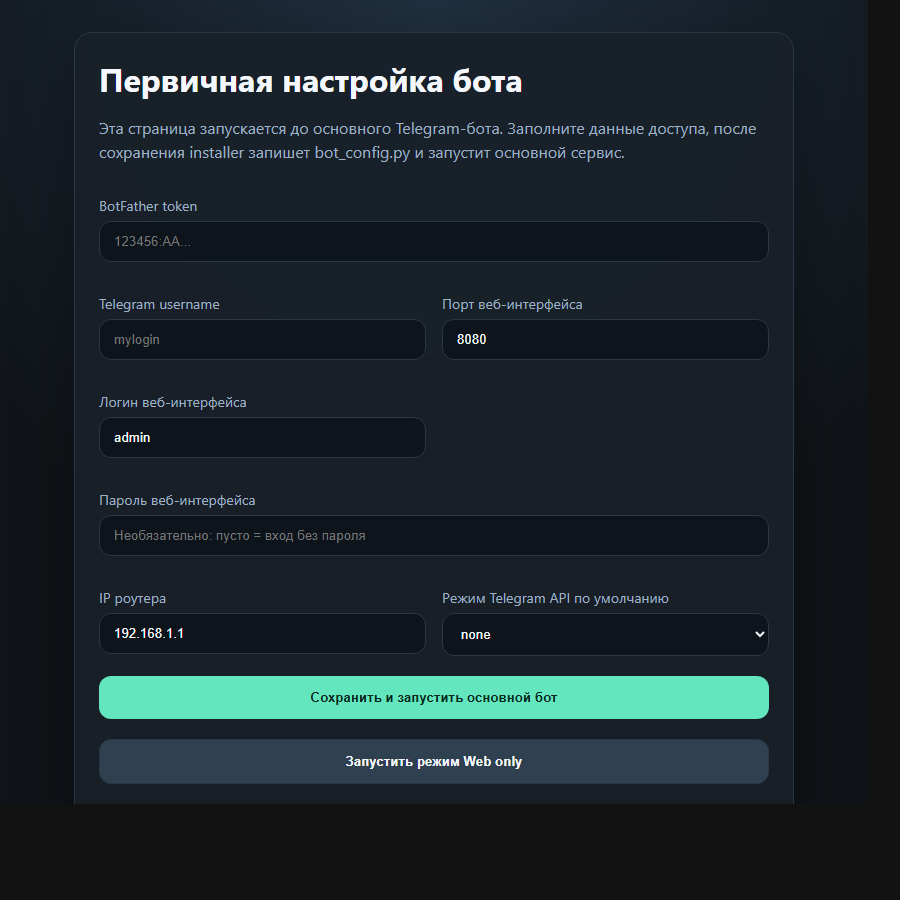
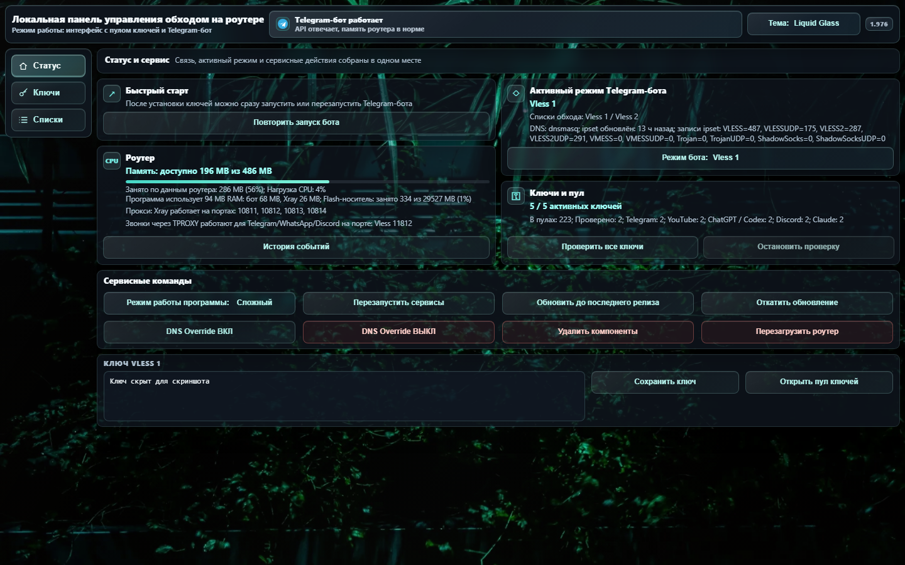
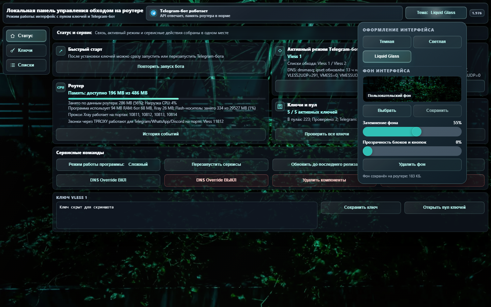
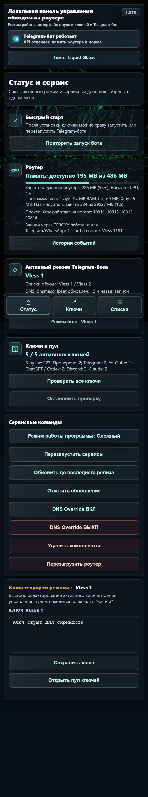
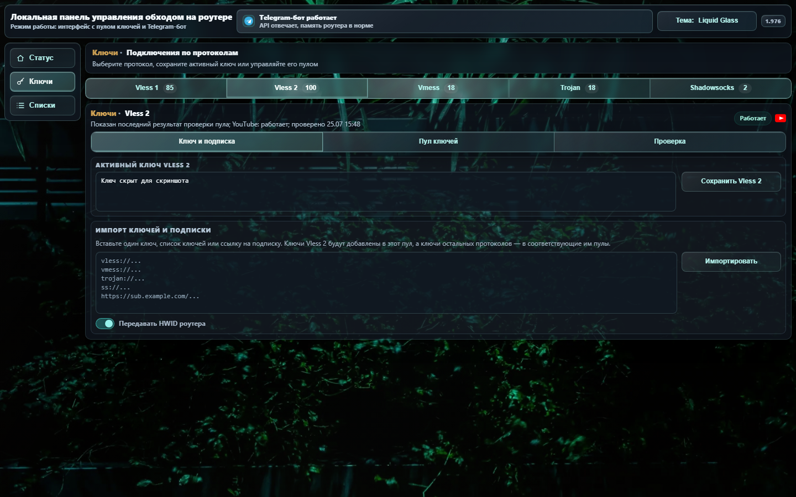
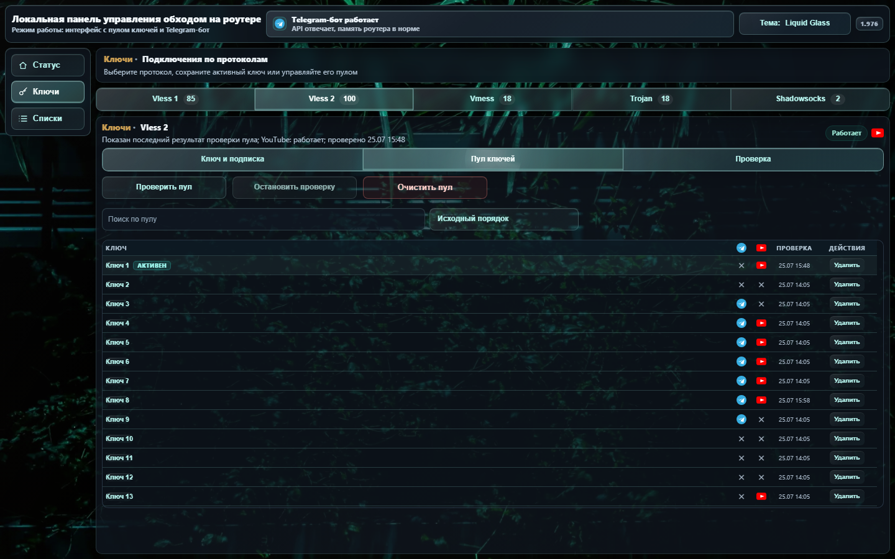
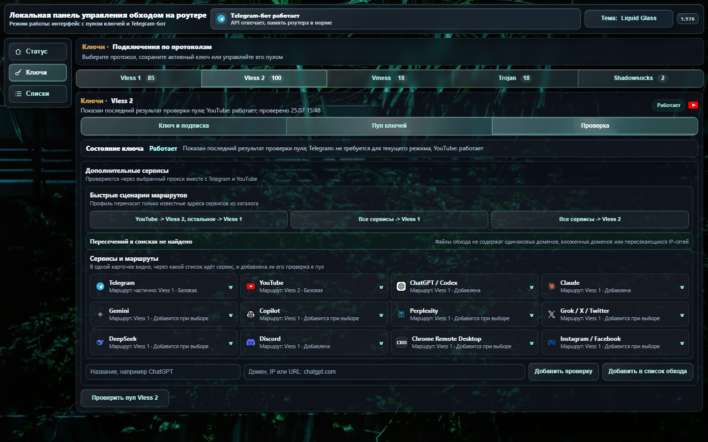
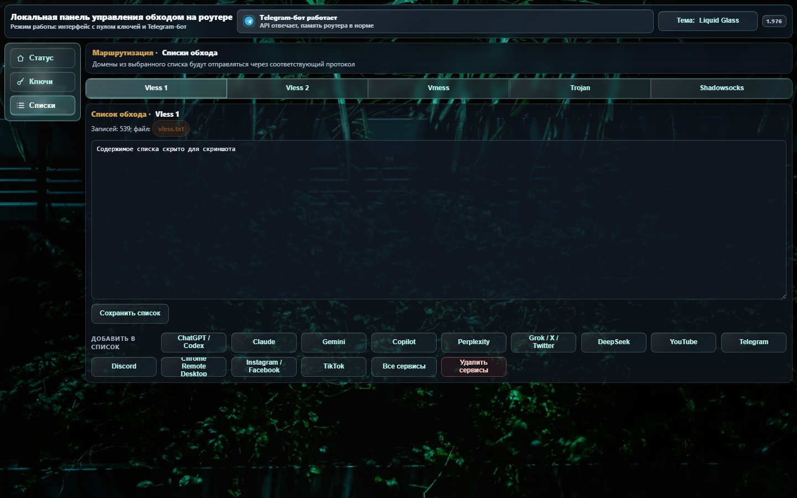

<a href="https://t.me/bypass_keenetic"></a>

# bypass_keenetic

Локальная панель управления обходом блокировок на роутерах Keenetic.

> Проверено на Keenetic Giga с актуальной KeeneticOS.

## Возможности

- Веб-интерфейс на `http://192.168.1.1:8080/` для ПК и телефона.
- Разделы **Статус**, **Ключи**, **Списки**.
- Тёмная и светлая темы, а также оформление **Liquid Glass**.
- Собственный фон веб-интерфейса: можно выбрать JPEG, PNG или WebP до 20 МБ с ПК, Android или iPhone. Браузер сжимает изображение до WebP размером не более 1 МБ, фон хранится локально на роутере; отдельно настраиваются затемнение фона и прозрачность блоков и кнопок.
- Telegram-бот для режимов **Простой** и **Сложный**.
- Поддержка двух протоколов `Vless`, протоколов `Vmess`, `Trojan`, `Shadowsocks`.
- Пул ключей для каждого протокола: ручное добавление, удаление, применение, импорт подписки.
- Проверка ключей через Telegram API, YouTube и дополнительные сервисы: ChatGPT/OpenAI/Codex, Claude, Gemini, Copilot, Perplexity, Grok, DeepSeek, Discord, Meta AI/Instagram/Facebook.
- Прогрев YouTube для ускорения загрузки видео.
- Автоматический обход realtime-звонков Telegram, WhatsApp и Discord: программа определяет активных клиентов, временно запоминает UDP-адреса звонка и отправляет их через TPROXY-порт выбранного протокола.
- Диагностика роутера в блоке **Статус**: память, нагрузка, состояние DNS, время последнего обновления `ipset` и количество записей в наборах обхода.

## Установка

Сначала установите Entware на накопитель роутера:
- [инструкция Entware для Keenetic](https://github.com/znetworkx/bypass_keenetic/wiki/Install-Entware-and-Preparation)
- `aarch64`: [aarch64-installer.tar.gz](https://bin.entware.net/aarch64-k3.10/installer/aarch64-installer.tar.gz)
- `mipsel`: [mipsel-installer.tar.gz](https://bin.entware.net/mipselsf-k3.4/installer/mipsel-installer.tar.gz)

Важно: бот и bootstrap не заменяют подготовку накопителя и установку Entware. На Keenetic Entware живёт в `/opt` и обычно требует внешнее хранилище.

После Entware подключитесь к роутеру по SSH и выполните:

```sh
sh -c 'set -eu; export PATH=/opt/bin:/opt/sbin:$PATH; OPKG="$(command -v opkg || echo /opt/bin/opkg)"; CURL_BIN="$(command -v curl || echo /opt/bin/curl)"; if [ ! -x "$CURL_BIN" ]; then "$OPKG" update && "$OPKG" install curl ca-bundle || exit 1; CURL_BIN="$(command -v curl || echo /opt/bin/curl)"; fi; TMP="/tmp/bypass-bootstrap-install.$$"; rm -rf "$TMP"; mkdir -p "$TMP"; trap "rm -rf \"$TMP\"" EXIT INT TERM; if ! "$CURL_BIN" -fsSL --connect-timeout 12 --max-time 45 -o "$TMP/install.sh" https://raw.githubusercontent.com/andruwko73/bypass_keenetic/main/bootstrap/install.sh; then "$CURL_BIN" -fsSL --connect-timeout 12 --max-time 90 -o "$TMP/repo.tar.gz" https://codeload.github.com/andruwko73/bypass_keenetic/tar.gz/refs/heads/main && tar -xzf "$TMP/repo.tar.gz" -C "$TMP" && cp "$TMP"/*/bootstrap/install.sh "$TMP/install.sh"; fi; [ -s "$TMP/install.sh" ] || exit 1; sh "$TMP/install.sh"'
```

Команда выше является актуальной командой чистой установки из GitHub `main`. Она ставит минимальный `curl`, скачивает `bootstrap/install.sh`, затем bootstrap скачивает основной `script.sh`, веб-установщик, Telegram-бота и все runtime-модули.

Команда сначала пробует `raw.githubusercontent.com`, затем GitHub archive через `codeload.github.com`. Это важно для чистой установки: fallback не требует уже установленного ключа или локального SOCKS. Если с чистого роутера недоступны и raw, и codeload, нужен временный прямой доступ к GitHub или ручная загрузка `bootstrap/install.sh`.

При первой чистой установке откроется первичная настройка на `http://192.168.1.1:8080/`.

Нужно указать:
- BotFather token;
- Telegram username;
- при желании пароль для веб-интерфейса.

Если Telegram-бот не нужен, нажмите **Запустить режим Web only**. Пароль веб-интерфейса не обязателен: если его не задать, доступ останется только с локальных/private адресов.

Bootstrap перед заменой файлов создает backup и rollback-скрипт в `/opt/root/bypass-last-rollback.sh`.

## Обновление со старых веток

Переход на новую ветку `main` должен быть плавным с любой старой установленной версии:
- `main`;
- `codex/main`;
- `codex/main-v1`;
- `codex/independent-v1`;
- `codex/web-only-v1`;
- `feature/independent-rework`;
- `feature/web-only`;
- `feature/without-telegram-bot`.

В старом Telegram-боте или веб-интерфейсе можно нажать обновление/переустановку из текущей ветки. Старое имя ветки будет вести на новый код `main`, после чего установленная программа уже будет обновляться из `main`.

При обновлении сохраняются:
- `/opt/etc/bot_config.py` или `/opt/etc/bot/bot_config.py`;
- активные ключи;
- пул ключей;
- пользовательские проверки;
- списки обхода;
- выбранный режим работы программы.

Ход обновления передаётся в веб-интерфейс и Telegram ограниченным фрагментом последних сообщений, поэтому длинный журнал не создаёт растущую нагрузку на роутер. Существующий процесс обновления контролируется по выводу и файлу статуса: при длительном отсутствии любой активности он получает мягкое завершение всей группы с запасом времени на автоматическое восстановление, а принудительное завершение остаётся последним шагом. Отдельный постоянный worker для этого не запускается; чистая установка по команде выше не изменилась.

Устаревшие артефакты старых вариантов очищаются: отдельный `web_bot.py`, старый web-only init-скрипт, tor/vpn пути и лишние runtime-файлы. Остаются только поддерживаемые протоколы: два `Vless`, `Vmess`, `Trojan`, `Shadowsocks`.

## Веб-интерфейс

**Статус**

Показывает состояние роутера, ключей, быстрый старт и сервисные команды. В режимах с ботом дополнительно отображаются Telegram API и активный режим Telegram-бота; в **Web only** эти элементы скрыты.

В блоке роутера DNS-часть показывает текущий режим и состояние `ipset`. Кнопки **DNS Override ВКЛ** и **DNS Override ВЫКЛ** явно переключают между штатным DNS Keenetic через `ndnproxy` и основным DNS через `dnsmasq`: в режиме `dnsmasq` наборы `ipset` наполняются динамически по route-файлам, а в режиме `ndnproxy` домены заранее резолвятся скриптом `/opt/bin/unblock_ipset.sh`. Обновление программы и перезагрузка сервисов не меняют DNS Override скрыто; плановый refresh поддерживает актуальность наборов, IPv6/UDP fallback и удаление пересечений между route-файлами. Неизменившаяся часовая проверка `dnsmasq` не сдвигает время последнего полного обновления, поэтому обязательный full refresh остаётся доступен через шесть часов.

UDP/443 обрабатывается по содержимому списков обхода: YouTube/QUIC-наборы создаются для того протокола, где сейчас находится YouTube, а Telegram остаётся на своём маршруте даже при совместном списке. Базовую политику можно поменять в `bot_config.py` через `udp_quic_block_*_enabled`, `youtube_quic_policy` и `telegram_udp_policy`.

Для мобильных уведомлений Telegram TCP/5222 следует за тем протоколом, в списке которого находится Telegram: Shadowsocks, VMess, VLESS1, VLESS2 или Trojan. Системные каналы push для iOS APNs (TCP/5223) и Android FCM (TCP/5228-5230) проходят напрямую, а слишком короткий таймаут установленных conntrack-соединений автоматически поднимается до 3600 секунд.

Realtime-звонки Telegram, WhatsApp и Discord работают без отдельной кнопки: программа определяет активных клиентов, временно запоминает связанные UDP-медиа-адреса и отправляет их через TPROXY-порт текущего протокола сервиса. Таймауты можно поменять параметрами `telegram_call_learning_client_timeout_seconds` и `telegram_call_learning_address_timeout_seconds` в `bot_config.py`.

Chrome Remote Desktop использует отдельное точное правило для штатного STUN-узла Google `74.125.247.128:3478/UDP`. Правило выбирает TPROXY-порт по фактическому маршруту сервиса, не записывает адрес в обучаемые `ipset` звонков и может работать одновременно со звонками Telegram, WhatsApp и Discord без нового фонового процесса.

Если общий Google-IP уже оказался в другом приоритетном маршруте, Xray дополнительно распознаёт TCP-домен Chrome Remote Desktop и возвращает каждый домен в единственный пользовательский список, где находится именно этот домен. Неоднозначные и отсутствующие в списках домены не переопределяются; правило не изменяет пользовательские списки, ipset или маршрутизацию звонков.

**Ключи**

Позволяет редактировать активный ключ, переключать протоколы, работать с пулом ключей и запускать проверки. В простом режиме пул ключей и расширенные проверки скрыты.

**Списки**

Редактирование списков обхода для каждого протокола. Готовые наборы можно добавлять кнопками: Telegram, YouTube, ChatGPT/Codex, Claude, Gemini, Copilot, Perplexity, Grok, DeepSeek, Discord, Chrome Remote Desktop, Meta AI/Instagram/Facebook или все сервисы сразу.

## Telegram-бот

Telegram-бот использует нижнюю клавиатуру и работает в режимах **Простой** и **Сложный**.

Основные разделы:
- управление активным протоколом и ключами;
- списки обхода;
- пул ключей в сложном режиме;
- сервисные команды;
- обновление до последнего релиза с подтверждением.
- откат последнего обновления из сохранённой резервной копии с подтверждением.

Путь к пулу: **Ключи** -> **Пул ключей**. Кнопки ключей содержат короткий код протокола, поэтому старая кнопка из другого пула не применит ключ к неверному протоколу.

В корне пула Telegram можно запустить **Проверить все ключи** или безопасно остановить текущую проверку. Проверка использует временный `xray`, не переключает установленные ключи и не перезаписывает активные маршруты; во время работы статус показывает последние сохранённые результаты, а после ручного полного запуска бот присылает одну итоговую сводку по пулу и сервисам. Веб-интерфейс отдельно показывает историческое число ключей **С сохранённым результатом**, текущий прогресс и **последнюю завершённую проверку**, поэтому начало нового запуска с нулевым прогрессом не стирает предыдущий результат. После успешного ночного обновления подписок полная проверка запускается в окне 03:00–06:00, безопасно продолжается после прерывания и ограничена тремя попытками. Subscription предлагает отдельный выбор между одноразовым импортом и синхронизацией с HWID и использует тот же защищённый backend, что веб-интерфейс.

## Пул ключей

Пул хранится локально на роутере:
- `/opt/etc/bot/key_pools.json`;
- `/opt/etc/bot/key_probe_cache.json`;
- `/opt/etc/bot/custom_checks.json`.

Проверка пула не переключает основной активный ключ и не разрывает текущее подключение. Для проверки остальных ключей запускается временный `xray` с отдельными SOCKS-портами. Результаты сохраняются сразу после проверки каждого ключа. Полная проверка проходит все ключи из всех пулов; при высокой нагрузке CPU или нехватке памяти она замедляется либо ставится на паузу, чтобы не забивать роутер.

Готовые сервисные кнопки в Telegram и веб-интерфейсе используют единый route-aware сценарий: адреса сервиса переносятся в выбранный протокольный список без удаления общих адресов, принадлежащих другим сервисам. После ручного изменения route-файла программа синхронизирует строгую политику Xray, а затем обновляет DNS/ipset; отдельный постоянный worker для этого не создаётся.

Активный ключ автоматически добавляется в свой пул, если его там нет. Это защищает от ситуации, когда текущий рабочий ключ пропадает из интерфейса после импорта или ручной чистки пула. Если один и тот же набор Vless-ключей используется и для `Vless 1`, и для `Vless 2`, их можно хранить одинаковыми списками; программа не печатает ключи в диагностике, не возвращает их в JSON-ответах действий и сравнивает их по внутренним идентификаторам.

При нехватке памяти проверка останавливается и может быть продолжена позже.

## Безопасность данных

Реальные ключи, токены Telegram, пароли, локальные пулы и кеши проверок должны оставаться только на роутере. Проверки Telegram и YouTube считают HTTP 4xx ответом отказа сервиса, а не подтверждением доступа. JSON API пула не отдаёт полные ключи даже при ручном `include_keys=1`; полные значения остаются только в серверной веб-форме, где их можно выделять и копировать.

В репозиторий не добавляются:
- `bot_config.py`;
- `.env`;
- дампы роутера;
- временные `xray`-конфиги;
- файлы с живыми прокси-ключами.

## Скриншоты

Скриншоты установленного веб-интерфейса сняты с текущего роутера в режиме **Сложный** и с пользовательским фоном. Ключи, имена и хэши пула, а также содержимое списков замаскированы.

Страница первичной настройки:

<a href="docs/screenshots/installer-setup.png">
  
</a>

Статус и сервис, версия для ПК:

<a href="docs/screenshots/web-ui-status.png">
  
</a>

Темы и пользовательский фон:

<a href="docs/screenshots/web-ui-background.png">
  
</a>

Статус и сервис, версия для телефона:

<a href="docs/screenshots/web-ui-status-mobile.png">
  
</a>

Ключ и подписка:

<a href="docs/screenshots/web-ui-key-subscription.png">
  
</a>

Пул ключей:

<a href="docs/screenshots/web-ui-pool.png">
  
</a>

Проверки доступности:

<a href="docs/screenshots/web-ui-check.png">
  
</a>

Списки обхода:

<a href="docs/screenshots/web-ui-lists.png">
  
</a>
