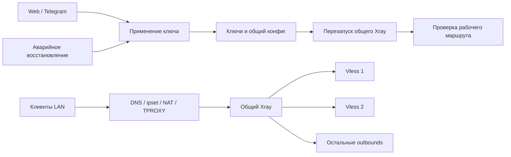

# Управление ключами, маршрутами и совместимость с GearUP

**Уточнение объёма 24.09.2026:** пользователь исключил GearUP, включая взаимодействие с приложением на роутере. Разделы GearUP ниже сохраняют результаты прежнего аудита и не входят в действующий план работ.

Аудит 24.09.2026. База: `main`, `84885e3dded3dda893102dcf79717cf168259754`, версия 1.1057. Локальный HEAD, origin/main и текущий GitHub main совпали. Семь ранее изменённых файлов установщика и его тестов сохранены.

## Границы проверки

Проверены цепочки ручного применения и восстановления ключей, генератор общего Xray, координатор проверки после применения, журнал failover, точки изменения маршрутов, изоляция Hysteria2 и соответствующая история Git. Прочитаны основные части правил перенаправления. На роутере выполнено только чтение версии, справки API, обезличенной структуры конфигурации и числа процессов. Это целевой аудит, а не проверка каждой строки репозитория или всех правил работающего роутера.

CodeGraph использован с явным путём основного проекта. Его выдача по крупному `bot.py` не дала запрошенные функции; конкретные цепочки дополнены чтением этого файла и AST. Соседние проекты не исследовались.

## Подтверждённые выводы

1. **Общий перезапуск при смене ключа подтверждён.** `_install_key_for_protocol` сначала записывает ключ и общий конфиг, затем `apply_installed_proxy_runtime` исполняет `restart_cmds`. Для всех шести протоколов среди них есть перезапуск общего core. Trojan/Shadowsocks дополнительно перезапускают отдельный сервис. Изменение одного ключа поэтому затрагивает другие соединения.
2. **Повторное применение уже оптимизировано с 1.1045.** `_active_key_endpoint_healthy` сверяет ключ на диске и SOCKS5 handshake. Это полезная, но неполная проверка: отвечать может процесс со старой конфигурацией; внешняя передача данных не проверяется в этом условии. Нельзя считать совпадение файла доказательством применённого состояния.
3. **Управление ещё не является одной транзакцией.** Ручной путь использует `threading.Lock`, причём только при включённом пуле. Запись конфига имеет отдельный lock. Есть другие пути: failover, восстановление, удаление активного ключа, смена маршрутов, запуск, исправление Reality endpoint. Журнал аварийного переключения полезен, но не заменяет общий межпроцессный координатор всех писателей.
4. **Существующие защиты нельзя потерять.** Ручное применение приостанавливает pool probe, проверка после применения последовательна, устаревший ключ не должен записывать результат; YouTube имеет stream guard, подтверждение аварии и возврат исходного ключа. Новое поколение запроса должно дополнить проверку идентичности: последовательность A→B→A не различается одной проверкой ключа.
5. **API доступен в бинарнике, но выключен в конфигурации.** Установлен Xray 26.2.6, revision `12ee51e4`, Linux arm64, Go 1.26.1. GitHub связывает tag v26.2.6 с `12ee51e4bb1d02ece4ef4b7114efa2bcdc130995`. Справка установленного бинарника содержит `ado/rmo/lso`, `adrules/rmrules/lsrules`, `bi/bo`. Наличие CLI не доказывает безопасное горячее применение.
6. **Есть ограничения точной реализации API.** В исходниках этого revision `AddHandler` отвергает существующий tag; `RemoveHandler` удаляет запись из map и **не вызывает Close**. Поэтому предположение «удаление всегда сразу обрывает всё» тоже не доказано. Нужны тесты удержания и освобождения ресурсов для каждого транспорта. `ReloadRules(append=false)` очищает старые правила до построения новых: последующая ошибка оставляет частично изменённое состояние. Метод не обновляет `domainStrategy`. Чтение маршрутов в `pickRouteInternal` не берёт mutex записи — гарантировать атомарность для трафика по этому коду нельзя.
7. **Hysteria2 требует отдельного допуска.** `take_isolated_probe_batch` намеренно даёт один HY2-ключ одному процессу из-за совместного auth-client cache. Нельзя переносить возможность нескольких VLESS-outbounds на HY2 без проверки этой причины в точной версии и отдельного стенда.

Пункты 1–5 подтверждены текущим кодом/чтением роутера. Пункт 6 — статический анализ upstream revision, не испытание работающего API. Пункт 7 — подтверждённое ограничение проекта; механизм cache в upstream в этом проходе глубоко не исследован.

## Карта действующих путей

Номера строк относятся к исходному HEAD; точные имена функций устойчивее номеров.

| Область | Вход → действия | Файлы и ориентиры |
|---|---|---|
| Web / Telegram | web actions / `_install_proxy_from_message` / `_apply_pool_key` → `_apply_manual_key_safely` → `_install_key_for_protocol` | `app/web_post_actions.py`; `app/bot.py`: 1569, 1593, 8312, 11158 |
| Запись ключа | `PROXY_KEY_INSTALLERS` → `vless/vless2/vmess/hysteria2/trojan/shadowsocks` → `_write_all_proxy_core_config` | `app/bot.py`: 16031–16159; `app/proxy_key_store.py`, `app/proxy_protocols.py` |
| Применение | `_apply_installed_proxy` → `apply_installed_proxy_runtime` → restart + локальная/сервисная проверка | `app/bot.py`: 14110–14145; `app/proxy_apply_runtime.py`: 44, 92 |
| Проверка после применения | `PostApplyCoordinator` → `_run_applied_key_live_probe` → при необходимости prefetch → возобновление пула | `app/post_apply_runtime.py`; `app/bot.py`: 11478–11545 |
| Telegram failover | `_attempt_auto_failover` → `attempt_auto_failover` → изолированный кандидат → install → runtime confirm / restore | `app/auto_failover_runtime.py`; callbacks в `app/bot.py` |
| YouTube failover | `_switch_youtube_to_verified_candidate` → checkpoint → install → confirm / `_restore_youtube_key_after_failed_failover` | `app/bot.py`: 2281, 2591, 2778; `app/youtube_failover_runtime.py`, `app/youtube_failover_transaction.py` |
| Удаление активного ключа | `_delete_pool_key` может установить замену | `app/bot.py`: около 11260 |
| Подписки | fetch/проверка shrink → синхронизация источника, сохранение активного ключа → дальнейшие действия пула | `app/subscription_runtime.py`, `app/subscription_refresh_runtime.py`; не приравнивать обновление списка к смене активного ключа |
| Маршруты | сохранение списков / service route → синхронизация политики → rebuild + restart; независимый service-route worker | `app/bot.py`: 5156, 8518, 8566; `app/web_route_tools_runtime.py`, `app/web_service_routes_worker.py` |
| Генерация | parser → `build_proxy_core_config`; после запуска/восстановления также `rebuild_proxy_core_config` | `app/proxy_config_builder.py`: 222; `app/proxy_config_recovery.py` |
| Перехват LAN | DNS/ipset → NAT REDIRECT / выделенные mangle TPROXY → transparent inbounds → доменные правила → outbound | `app/100-redirect.sh`, `app/transparent_route_policy.py`, `app/proxy_config_builder.py` |

На роутере один Xray, один бот, один отдельный Trojan. В общем Xray шесть proxy-outbounds и direct. SOCKS Vless1/Vless2 — 10811/10813; transparent — 10812/10814. SOCKS слушают loopback; transparent доступны для перехвата LAN. API-listener отсутствует.

В `100-redirect.sh` исходные значения TPROXY: mark `0x71`, table/priority `100`, chain `BYPASS_TG_CALL_TPROXY`. Правило fwmark не задаёт отдельную маску; значение нельзя считать свободным пространством для GearUP. Реальные переопределения, IPv6 и полное взаимодействие всех hooks ещё надо снять обезличенным аудитом. RETURN одной цепочки не доказывает отсутствие повторного перехвата в другой.

## История, которую необходимо сохранить

| Commit | Что установлено по истории / изменению |
|---|---|
| `af0e933` | Введена поддержка Hysteria2; история `-S auth-client cache` указывает сюда для одноключевой изоляции probe |
| `1d8bcf5` / 1.1042 | Telegram failover получил checkpoint до установки, подтверждение в постоянном runtime, возврат исходного ключа; журнал хранит исходный ключ приватно для восстановления |
| `b8526bd` / 1.1045 | Общий ручной путь, существующий no-op по SOCKS, последовательный post-apply worker, устранение дублирующих проверок |
| `9004f54` / 1.1049 | Защита воспроизведения YouTube от ложного аварийного переключения |
| `1b10ab9`, `1f65f34` / 1.1050–1.1051 | Несколько подписок и сохранение транспортных параметров импортированных ключей |
| `6d616b1` / 1.1055 | Снижение нагрузки разбора списков и фоновый web status |
| `ef2d214`, `84885e3` / 1.1056–1.1057 | Доменные маршруты при общем IP и исправление готовности реального Xray-стенда |

Подробно просмотрены изменения применения в 1.1045 и транзакций в 1.1042. Остальные строки — история и текущее покрытие по соответствующей области, не обещание полного повторного review каждого commit. Историческая память 1.1045 подтверждает 6/6 повторных применений без смены PID; это **не тест сохранения реальных сессий**.

## Варианты горячего применения

| Вариант | Польза | Ограничение / решение |
|---|---|---|
| Подтверждённый no-op | Ноль изменений рабочего процесса | Нужны эффективный конфиг, identity процесса с временем старта/boot id, актуальное поколение и свежая проверка данных |
| Remove/Add того же tag | Мало изменений | Есть окно отсутствующего tag; семантика drain/очистки не подтверждена. Не выбирать первым |
| Новый generation-tag + переключение новых сессий | Позволяет удержать старый outbound и не трогать другие | Предпочтительное направление после стенда; нужна транзакция, лимит поколений, rollback и доказанный drain |
| Routing API / balancer override | Возможен перевод новых потоков без смены PID | `ReloadRules` не является rollback-safe; balancer тоже требует отдельной проверки. Нельзя скрыто заменять весь ruleset |
| Отдельный Xray для игрового профиля | Изоляция отказов от основных сервисов | Дополнительные RAM/CPU/службы; решение после измерений, не автоматическое раздвоение общего Xray |
| Перезапуск core | Нужен для части изменений процесса/старта | Явный контролируемый путь. Ошибка API сама по себе не разрешает общий restart |

Существующий TCP/UDP поток нельзя переносить между произвольными внешними IP/NAT с обещанием непрерывности. Цель: сохранить незатронутые потоки и старые работающие поколения до drain; при отзыве ключа или полном отказе честно сообщить о возможном переподключении.

## Собственная оптимизация и GearUP

Собственная система — общий выбор разрешённого маршрута для устройства и назначения; игровой профиль — одно применение. Кандидат содержит WAN, direct/proxy, транспорт и назначение. Измерительный узел не становится relay автоматически.

| Критерий | Собственная система | GearUP |
|---|---|---|
| Польза | Выбор среди имеющихся WAN/ключей/direct; понятные причины | Возможная польза сети производителя; фактический выигрыш на этом маршруте пока не измерен |
| Управление | Наши профили и правила; сначала рекомендации | Сначала официальное приложение; затем адаптер совместимости; полное управление только при подтверждённом API и разрешении |
| Измерения | Отдельно доступность, контролируемый UDP и метрика приложения | Не приравнивать состояние connected или цифру приложения к независимому измерению |
| Инфраструктура | Без relay на первом уровне; measurement nodes отдельно | Зависимость от сервиса производителя |
| Ресурсы | Ограничиваем concurrency, трафик, поколения | RAM/CPU, фоновые процессы, storage, offload пока неизвестны |
| Отказ/обновление | Собственный журнал и обратимые изменения | Нужны сценарии stop/update/remove и восстановление владения трафиком |
| Стоимость | Имеющиеся ключи/WAN; узлы и relay требуют отдельных расходов | Условия аккаунта/подписки производителя; стоимость здесь не оценивалась |
| Сессии | Pinning новых связанных потоков; авария может потребовать reconnect | Сохранение сессий при смене маршрута не подтверждено нашим тестом |
| Лицензии | Репозиторий MIT; Xray MPL-2.0 | Ограниченная персональная лицензия; поставка бинарников и встроенное управление требуют отдельной проверки прав |

Официальная beta-инструкция от 17.08.2026 перечисляет KN-1012 с установкой во внутреннюю память и управлением из GearUP Router App. Существующий Entware переустанавливать не надо. [Инструкция](https://www.gearupbooster.com/support/keenetic-netcraze-router-plugin-guide.html).

Статически прочитаны две ступени официальной установки, **не исполнены**. Bootstrap обновляет opkg и устанавливает зависимости, затем скачивает изменяемый install script. Вторая ступень скачивает uninstall/monitor, запускает cleanup до установки, создаёт `/opt/gu` и `S99guplugin`; проверка готовности основана на процессе. Это не доказывает соединение или ускорение. Полная цепочка monitor/binary/firewall ещё не исследована. SHA256 bootstrap: `a1676519cdcb9ddbd546981f5b9536a07066206d5999d7fef422327ed9ce0458`; второй ступени: `ba5dcce6b33b02d1e814edae48675527439e3b5779a98c502798281eb6c176b7`.

AIR и оптимальные маршруты — заявления производителя, не результат сравнения на нашем оборудовании. [Описание работы](https://www.gearupbooster.com/support/how-does-it-work.html), [AIR](https://www.gearupbooster.com/support/what-is-adaptive-intelligent-routing-technology.html). В просмотренной документации не установлен поддерживаемый API для полного управления; это не доказательство отсутствия такого API.

Разделы 3.1–3.2 ограничивают передачу, модификацию и распространение ПО. До выяснения прав не включать закрытые компоненты в наши пакеты и не хранить аккаунт GearUP в наших настройках. [Соглашение](https://www.gearupbooster.com/license/user-agreement.html). Проверен локальный `LICENSE` MIT и [LICENSE точной версии Xray](https://github.com/XTLS/Xray-core/blob/12ee51e4bb1d02ece4ef4b7114efa2bcdc130995/LICENSE); при распространении соблюдать уведомления и требования MPL к изменённым покрытым файлам.

## Источники Xray

- [API](https://xtls.github.io/en/config/api.html): наличие сервисов управления; runtime API сам по себе не синхронизирует наши ключевые файлы.
- [Observatory](https://xtls.github.io/en/config/observatory.html): HTTP-проверки через outbound; они не измеряют игровые UDP loss/jitter.
- [Outbound manager точной версии](https://github.com/XTLS/Xray-core/blob/12ee51e4bb1d02ece4ef4b7114efa2bcdc130995/app/proxyman/outbound/outbound.go).
- [Router точной версии](https://github.com/XTLS/Xray-core/blob/12ee51e4bb1d02ece4ef4b7114efa2bcdc130995/app/router/router.go).
- [Handler точной версии](https://github.com/XTLS/Xray-core/blob/12ee51e4bb1d02ece4ef4b7114efa2bcdc130995/app/proxyman/outbound/handler.go).

Перечень испытаний и нерешённых вопросов: [TEST_PLAN.md](TEST_PLAN.md), последовательность работ: [IMPLEMENTATION_PLAN.md](IMPLEMENTATION_PLAN.md).
